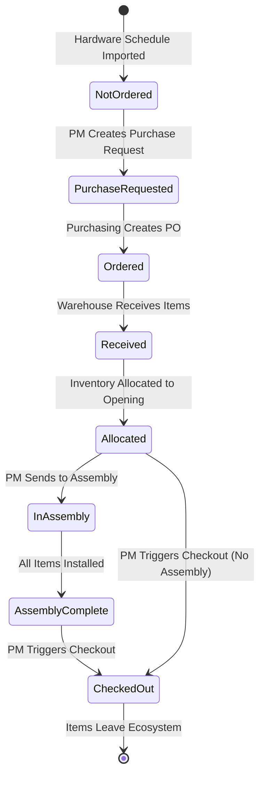

# Epic: Develop SAP Application with Purchasing, Warehouse, and Customer Modules

---

# Core User Flows

# Core User Flows

This document defines the step-by-step user journeys for the SAP door hardware management application. Each flow describes user actions, UI feedback, and navigation patterns.

## Navigation Structure

### Global Layout

**Key Elements:**

- **Sidebar Navigation**: Expandable module sections for easy access
- **Global Project Selector**: Filters all views to selected project
- **Notification Bell**: Shows pending actions and alerts
- **User Menu**: Access to profile and settings

---

## Flow 1: Hardware Schedule Import (New Project)

**Trigger**: Admin/PM clicks "Import Hardware Schedule" in Projects module

**Steps**:

1. User navigates to Projects module via sidebar
2. User clicks "Import Hardware Schedule" button
3. File upload dialog appears
4. User selects XML hardware schedule file
5. System parses XML and shows preview:
  - Project metadata (name, contractor, address, etc.)
  - Count of openings, doors, hardware items
6. User reviews preview and clicks "Import"
7. System creates:
  - Project record
  - Opening records (status: "Not Ordered")
  - Door Leaf records (status: "Not Ordered")
  - Hardware Item records (status: "Not Ordered")
8. Success toast notification appears (using shadcn sonner)
9. User is navigated to the new project detail page
10. Project appears in global project selector

**UI Feedback**:

- Loading spinner during parsing
- Progress indicator during import
- Success toast with project name
- New project highlighted in project list

---

## Flow 2: Hardware Schedule Update (Existing Project)

**Trigger**: Admin/PM clicks "Update Hardware Schedule" for an existing project

**Steps**:

1. User navigates to project detail page
2. User clicks "Update Hardware Schedule" button
3. File upload dialog appears
4. User selects updated XML file
5. System parses and compares with existing data
6. Full-page review screen appears with sections:
  - **Summary**: Counts of new, deleted, unchanged openings/items
  - **Detailed Changes**: Side-by-side diff view
  - **Impact Analysis**: Shows affected modules (POs, inventory, assembly, checkouts)
7. User reviews each section
8. User clicks "Approve Update" with confirmation dialog showing impact summary
9. System applies changes:
  - Creates new openings/items (status: "Not Ordered")
  - Marks deleted openings/items
  - Returns items from deleted openings to unallocated inventory
10. Success toast notification
11. User returns to updated project detail page

**UI Feedback**:

- Loading during comparison
- Color-coded changes (green=new, red=deleted, yellow=modified)
- Warning badges for items in assembly or checked out
- Confirmation dialog with impact summary

---

## Flow 3: Purchase Request Creation (PM → Purchasing)

**Trigger**: PM decides certain openings need to be ordered based on project schedule

**Steps**:

1. PM navigates to project detail page
2. PM views list of openings (expandable to see items)
3. PM selects openings that need to be ordered (checkboxes)
4. PM clicks "Create Purchase Request" button
5. Modal appears showing:
  - Selected openings
  - Total doors and hardware items
  - Estimated total cost (if available)
6. PM adds notes/priority and clicks "Submit Request"
7. System creates purchase request record
8. Purchase request appears in Purchasing module queue
9. Success toast notification
10. Selected openings show "Purchase Requested" badge

**UI Feedback**:

- Selected count indicator
- Validation: can't request openings already ordered
- Toast notification to PM
- Notification to Purchasing users

---

## Flow 4: Purchase Order Creation (Purchasing)

**Trigger**: Purchasing user sees purchase request in their queue

**Steps**:

1. Purchasing user navigates to Purchase Orders module
2. User sees "Purchase Requests" tab with pending requests
3. User clicks on a purchase request to view details
4. System shows:
  - Requested openings
  - All doors and hardware items needed
  - Vendor information (from item data)
5. User groups items by vendor
6. For each vendor, user creates a PO:
  - Selects vendor from dropdown
  - Reviews line items (auto-populated)
  - Adjusts quantities if needed
  - Adds expected delivery date
  - Adds notes/terms
7. User clicks "Create PO" for each vendor
8. System creates PO records (status: "Draft")
9. User reviews all draft POs
10. User clicks "Send POs" to finalize
11. PO status changes to "Sent"
12. Items status changes from "Not Ordered" to "Ordered"
13. Success toast notification

**UI Feedback**:

- Auto-grouping by vendor
- Validation: all items must be assigned to a PO
- Draft POs can be edited before sending
- Toast notification when POs are sent

---

## Flow 5: Receiving Items (Warehouse)

**Trigger**: Warehouse staff receives shipment from vendor

**Steps**:

1. Warehouse user navigates to Receiving module
2. User sees list of open POs (status: "Sent" or "Partially Received")
3. User selects PO to receive against
4. System shows PO line items with expected quantities
5. For each line item, user enters actual quantity received
6. If quantity differs from expected:
  - System shows warning
  - User must enter reason/note for discrepancy
7. User enters warehouse location for each item
8. User clicks "Complete Receipt"
9. System:
  - Creates receipt record
  - Adds items to inventory (status: "Unallocated")
  - Updates PO status (Partially Received or Completed)
  - Updates item status from "Ordered" to "Received"
10. Success toast notification
11. Receipt confirmation screen with summary

**UI Feedback**:

- Quantity validation (can't receive more than ordered without override)
- Discrepancy warnings
- Location autocomplete
- Receipt summary with print option

---

## Flow 6: Inventory Allocation (PM/Inventory Manager)

**Trigger**: User wants to allocate inventory to specific openings

**Steps**:

1. User navigates to Inventory module
2. User selects project from global selector
3. Inventory view shows items grouped by: Project → Opening → (Doors + Hardware)
4. User sees unallocated items in a separate section
5. User drags unallocated item to target opening
6. System validates:
  - Item matches opening requirements
  - Item is not already allocated
7. Confirmation dialog shows allocation details
8. User confirms
9. System updates item allocation status
10. Item moves from "Unallocated" to opening's item list
11. Item badge changes to "Allocated to Opening [number]"
12. Success toast notification

**UI Feedback**:

- Drag-and-drop visual feedback
- Drop zones highlighted when dragging
- Validation errors shown immediately
- Color-coded allocation status badges

---

## Flow 7: Assembly Work Trigger (PM)

**Trigger**: PM decides certain openings are ready for assembly

**Steps**:

1. PM navigates to project detail page
2. PM views openings list
3. PM selects openings ready for assembly (checkboxes)
4. PM clicks "Send to Assembly" button
5. Confirmation dialog shows:
  - Selected openings
  - Items that will be pulled from warehouse
  - Warning if any items not yet received
6. PM confirms
7. System creates warehouse pull request (type: "Assembly")
8. Pull request appears in Warehouse module
9. Openings status changes to "Pending Assembly"
10. Success toast notification
11. Notification sent to Warehouse users

**UI Feedback**:

- Validation: can't send openings without allocated items
- Warning for partially allocated openings
- Confirmation with impact summary
- Toast notifications

---

## Flow 8: Warehouse Pull for Assembly

**Trigger**: Warehouse user sees assembly pull request

**Steps**:

1. Warehouse user navigates to Pull Requests module
2. User sees pull requests grouped by project, with type indicators
3. User clicks on assembly pull request
4. System shows:
  - Openings to be pulled
  - All doors and hardware items needed
  - Current warehouse locations
5. User marks pull as "In Progress"
6. For each item, user:
  - Locates item in warehouse
  - Enters quantity pulled
  - Checks off item
7. User clicks "Complete Pull"
8. System:
  - Updates item allocation status to "In Assembly"
  - Creates pull completion record
  - Openings automatically appear in Assembly queue
9. Success toast notification
10. Notification sent to Assembly users

**UI Feedback**:

- Pull status: Pending → In Progress → Completed
- Item checklist with locations
- Support for partial pulls
- Completion summary

---

## Flow 9: Assembly Installation Work

**Trigger**: Assembly technician sees openings in their queue

**Steps**:

1. Assembly user navigates to Assembly Work module
2. User sees openings grouped by project
3. User expands project to see openings
4. User clicks on an opening to work on
5. Opening detail view shows:
  - Opening properties
  - Door leafs (separate section)
  - Hardware items (separate section)
  - Each item has checkbox for "Installed"
6. As technician installs items, they check boxes
7. System auto-saves progress
8. When all items installed, opening status changes to "Assembly Complete"
9. User moves to next opening
10. Progress tracked in real-time

**UI Feedback**:

- Auto-save indicator
- Progress bar showing completion %
- Color-coded status (not started, in progress, complete)
- Toast notification when opening completed

---

## Flow 10: Checkout Trigger (PM)

**Trigger**: PM decides openings are ready to ship to construction site

**Steps**:

1. PM navigates to Checkout module
2. PM selects project from dropdown
3. Multi-step wizard begins:
  - **Step 1: Select Openings**
    - List of openings with status indicators
    - PM selects openings to checkout (checkboxes)
  - **Step 2: Review Items**
    - Shows all items for selected openings
    - Indicates which items are installed vs not installed
    - Shows warehouse pull requirements
  - **Step 3: Confirm Checkout**
    - Summary of what will be shipped
    - Impact: items will leave inventory permanently
    - Warehouse pull request will be created
4. PM clicks "Confirm Checkout"
5. Confirmation dialog with impact summary
6. System creates:
  - Checkout record
  - Warehouse pull request (type: "Checkout")
7. Pull request appears in Warehouse module
8. Success toast notification
9. Notification sent to Warehouse users

**UI Feedback**:

- Validation: can't checkout openings without all items received
- Warning for openings with uninstalled items
- Multi-step progress indicator
- Confirmation with detailed summary

---

## Flow 11: Warehouse Pull for Checkout

**Trigger**: Warehouse user sees checkout pull request

**Steps**:

1. Warehouse user navigates to Pull Requests module
2. User sees checkout pull request (type: "Checkout")
3. User clicks on pull request
4. System shows:
  - Openings being checked out
  - Only uninstalled items (installed items already with opening)
  - Warehouse locations
5. User marks pull as "In Progress"
6. User pulls uninstalled items
7. User enters quantities pulled for each item
8. User clicks "Complete Pull"
9. System updates item status to "Checked Out"
10. Checkout status changes to "Ready to Ship"
11. Success toast notification

**UI Feedback**:

- Clear distinction: only uninstalled items shown
- Pull progress tracking
- Completion summary

---

## Flow 12: Checkout Completion

**Trigger**: Warehouse completes pull for checkout

**Steps**:

1. PM or Warehouse user navigates to Checkout module
2. User sees checkout with status "Ready to Ship"
3. User clicks "Complete Checkout"
4. Confirmation dialog shows:
  - All openings being shipped
  - All items (installed + pulled)
  - Impact: items will leave inventory permanently
5. User confirms
6. System:
  - Removes all items from inventory
  - Updates opening status to "Checked Out"
  - Creates checkout completion record
7. Checkout confirmation/summary screen appears showing:
  - Checkout number
  - Date/time
  - Openings shipped
  - Total items
  - Option to print packing list
8. User can return to project view or view checkout history

**UI Feedback**:

- Confirmation with detailed impact
- Success screen with summary
- Print/export options
- Toast notification

---

## Dashboard View

---

## State Diagram

---

## Key Interaction Patterns

### Color-Coded Status Badges

- **Not Ordered**: Yellow (#fef3c7)
- **Purchase Requested**: Blue (#dbeafe)
- **Ordered**: Purple (#e9d5ff)
- **Received**: Green (#d1fae5)
- **Allocated**: Cyan (#cffafe)
- **In Assembly**: Orange (#fed7aa)
- **Assembly Complete**: Green (#86efac)
- **Checked Out**: Gray (#e5e7eb)

### Notification Patterns

- **Toast Notifications**: Use shadcn sonner for all real-time feedback
- **Task List**: Pending actions shown in dashboard and notification center
- **Real-time Updates**: Auto-refresh when state changes occur

### Validation Rules

- Can't create purchase request for already ordered openings
- Can't send to assembly without allocated items
- Can't checkout without all items received
- Can't receive more than ordered without override
- Drag-and-drop only works for unallocated items

### Confirmation Dialogs

- All critical actions show impact summary
- Destructive actions require explicit confirmation
- Multi-step wizards for complex workflows

&nbsp;
