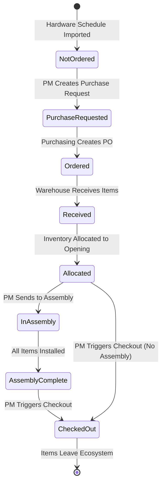

# Epic: Develop SAP Application with Purchasing, Warehouse, and Customer Modules

---

# Core User Flows

# Core User Flows

This document defines the step-by-step user journeys for the SAP door hardware management application. Each flow describes user actions, UI feedback, and navigation patterns.

## Navigation Structure

### Global Layout

<!DOCTYPE html>
<html>
<head>

</head>
<body>

  

    
UC Covet SAP

    
    

      
Main

      
Dashboard

    

    
    

      
Project Management

      
Projects

      
Purchase Requests

      
Checkout

    

    
    

      
Purchasing

      
Vendors

      
Purchase Orders

    

    
    

      
Warehouse

      
Receiving

      
Pull Requests

      
Inventory

    

    
    

      
Assembly

      
Assembly Work

    

  

  
  

    

      <select class="project-selector" data-element-id="project-selector">
        <option>All Projects</option>
        <option>Project 74 - Main Street Building</option>
        <option>Project 82 - Downtown Office</option>
      </select>
      
      

        
🔔

        
John Doe (Admin)

      

    

    
    

      <h1>Dashboard</h1>
      
Main content area

    

  

</body>
</html>

**Key Elements:**

- **Sidebar Navigation**: Expandable module sections for easy access
- **Global Project Selector**: Filters all views to selected project
- **Notification Bell**: Shows pending actions and alerts
- **User Menu**: Access to profile and settings

---

## Flow 1: Hardware Schedule Import (New Project)

**Trigger**: Admin/PM clicks "Import Hardware Schedule" in Projects module

**Steps**:

1. User navigates to Projects module via sidebar
2. User clicks "Import Hardware Schedule" button
3. File upload dialog appears
4. User selects XML hardware schedule file
5. System parses XML and shows preview:
  - Project metadata (name, contractor, address, etc.)
  - Count of openings, doors, hardware items
6. User reviews preview and clicks "Import"
7. System creates:
  - Project record
  - Opening records (status: "Not Ordered")
  - Door Leaf records (status: "Not Ordered")
  - Hardware Item records (status: "Not Ordered")
8. Success toast notification appears (using shadcn sonner)
9. User is navigated to the new project detail page
10. Project appears in global project selector

**UI Feedback**:

- Loading spinner during parsing
- Progress indicator during import
- Success toast with project name
- New project highlighted in project list

<!DOCTYPE html>
<html>
<head>

</head>
<body>

  <h1>Projects</h1>
  

    <button class="btn-primary" data-element-id="import-schedule">Import Hardware Schedule</button>
    <button class="btn-secondary" data-element-id="update-schedule">Update Hardware Schedule</button>
  

  

    <h2>Import Hardware Schedule</h2>
    
Review the parsed data before importing

    
    

      
Project Information

      

        
<strong>Name:</strong> Main Street Building

        
<strong>Project ID:</strong> 74

        
<strong>Contractor:</strong> ABC Construction

        
<strong>Location:</strong> 123 Main St, Springfield, IL 62701

      

    

    
    

      

        
156

        
Openings

      

      

        
312

        
Door Leafs

      

      

        
1,248

        
Hardware Items

      

    

    
    

      <button class="btn-secondary" data-element-id="cancel-import">Cancel</button>
      <button class="btn-primary" data-element-id="confirm-import">Import Project</button>
    

  

</body>
</html>

---

## Flow 2: Hardware Schedule Update (Existing Project)

**Trigger**: Admin/PM clicks "Update Hardware Schedule" for an existing project

**Steps**:

1. User navigates to project detail page
2. User clicks "Update Hardware Schedule" button
3. File upload dialog appears
4. User selects updated XML file
5. System parses and compares with existing data
6. Full-page review screen appears with sections:
  - **Summary**: Counts of new, deleted, unchanged openings/items
  - **Detailed Changes**: Side-by-side diff view
  - **Impact Analysis**: Shows affected modules (POs, inventory, assembly, checkouts)
7. User reviews each section
8. User clicks "Approve Update" with confirmation dialog showing impact summary
9. System applies changes:
  - Creates new openings/items (status: "Not Ordered")
  - Marks deleted openings/items
  - Returns items from deleted openings to unallocated inventory
10. Success toast notification
11. User returns to updated project detail page

**UI Feedback**:

- Loading during comparison
- Color-coded changes (green=new, red=deleted, yellow=modified)
- Warning badges for items in assembly or checked out
- Confirmation dialog with impact summary

<!DOCTYPE html>
<html>
<head>

</head>
<body>

  

    <h2 style="margin: 0;">Review Hardware Schedule Update</h2>
    
Project 74 - Main Street Building

  

  

    <button class="btn-secondary" data-element-id="cancel-review">Cancel</button>
    <button class="btn-primary" data-element-id="approve-update">Approve Update</button>
  

  

    
Summary of Changes

    

      

        
12

        
New Openings

        
24 Doors, 96 Hardware Items

      

      

        
5

        
Deleted Openings

        
10 Doors, 40 Hardware Items

      

      

        
139

        
Unchanged Openings

      

    

  

  
  

    
Detailed Changes

    <table class="diff-table">
      <thead>
        <tr>
          <th>Opening</th>
          <th>Change Type</th>
          <th>Location</th>
          <th>Doors</th>
          <th>Hardware Items</th>
        </tr>
      </thead>
      <tbody>
        <tr>
          <td>101A</td>
          <td>NEW</td>
          <td>Building A, Floor 1</td>
          <td>2</td>
          <td>8</td>
        </tr>
        <tr>
          <td>205B</td>
          <td>DELETED</td>
          <td>Building B, Floor 2</td>
          <td>2</td>
          <td>8</td>
        </tr>
      </tbody>
    </table>
  

  
  

    
Impact Analysis

    

      <strong>⚠️ Assembly Impact:</strong> Opening 205B has 3 hardware items already installed. These will be returned to inventory.
    

    

      <strong>⚠️ Inventory Impact:</strong> 40 hardware items from deleted openings will return to unallocated status.
    

    

      <strong>📦 Purchasing Impact:</strong> 96 new hardware items and 24 doors will need to be ordered.
    

  

</body>
</html>

---

## Flow 3: Purchase Request Creation (PM → Purchasing)

**Trigger**: PM decides certain openings need to be ordered based on project schedule

**Steps**:

1. PM navigates to project detail page
2. PM views list of openings (expandable to see items)
3. PM selects openings that need to be ordered (checkboxes)
4. PM clicks "Create Purchase Request" button
5. Modal appears showing:
  - Selected openings
  - Total doors and hardware items
  - Estimated total cost (if available)
6. PM adds notes/priority and clicks "Submit Request"
7. System creates purchase request record
8. Purchase request appears in Purchasing module queue
9. Success toast notification
10. Selected openings show "Purchase Requested" badge

**UI Feedback**:

- Selected count indicator
- Validation: can't request openings already ordered
- Toast notification to PM
- Notification to Purchasing users

<!DOCTYPE html>
<html>
<head>

</head>
<body>

  

    <h1>Project 74 - Main Street Building</h1>
    
156 Openings

  

  

    3 openings selected
    6 doors, 24 hardware items
  

  <button class="btn-primary" data-element-id="create-purchase-request">Create Purchase Request</button>

  

    <input type="checkbox" class="checkbox" checked data-element-id="select-opening-101">
    

      
101A Not Ordered

      
Building A, Floor 1, Room 101

    

    <button class="expand-btn" data-element-id="expand-101">▼</button>
  

  
  

    

      
Door Leafs (2)

      
3'0" x 7'0" Hollow Metal Door - Not Ordered

      
3'0" x 7'0" Hollow Metal Door - Not Ordered

    

    

      
Hardware Items (8)

      
Schlage L9050 Lever Lock - Not Ordered

      
LCN 4040XP Door Closer - Not Ordered

      
Hinge, 4.5" x 4.5" - Not Ordered

      
Exit Device, Von Duprin 99 - Not Ordered

      
+ 4 more items

    

  

  
  

    <input type="checkbox" class="checkbox" checked data-element-id="select-opening-102">
    

      
102A Not Ordered

      
Building A, Floor 1, Room 102

    

    <button class="expand-btn" data-element-id="expand-102">▶</button>
  

  
  

    <input type="checkbox" class="checkbox" data-element-id="select-opening-103">
    

      
103A Purchase Requested

      
Building A, Floor 1, Room 103

    

    <button class="expand-btn" data-element-id="expand-103">▶</button>
  

</body>
</html>

---

## Flow 4: Purchase Order Creation (Purchasing)

**Trigger**: Purchasing user sees purchase request in their queue

**Steps**:

1. Purchasing user navigates to Purchase Orders module
2. User sees "Purchase Requests" tab with pending requests
3. User clicks on a purchase request to view details
4. System shows:
  - Requested openings
  - All doors and hardware items needed
  - Vendor information (from item data)
5. User groups items by vendor
6. For each vendor, user creates a PO:
  - Selects vendor from dropdown
  - Reviews line items (auto-populated)
  - Adjusts quantities if needed
  - Adds expected delivery date
  - Adds notes/terms
7. User clicks "Create PO" for each vendor
8. System creates PO records (status: "Draft")
9. User reviews all draft POs
10. User clicks "Send POs" to finalize
11. PO status changes to "Sent"
12. Items status changes from "Not Ordered" to "Ordered"
13. Success toast notification

**UI Feedback**:

- Auto-grouping by vendor
- Validation: all items must be assigned to a PO
- Draft POs can be edited before sending
- Toast notification when POs are sent

<!DOCTYPE html>
<html>
<head>

</head>
<body>

  <h1>Purchase Orders</h1>

  <button class="tab active" data-element-id="tab-requests">Purchase Requests (3)</button>
  <button class="tab" data-element-id="tab-pos">Purchase Orders (12)</button>

  

    

      <h3 style="margin: 0;">Purchase Request #PR-2024-001</h3>
      
Project 74 - Main Street Building

      
Requested by: John Doe (PM) on Jan 15, 2024

    

    Pending
  

  
  

    <strong>3 Openings:</strong> 101A, 102A, 103A 
    <strong>Total Items:</strong> 6 Doors, 24 Hardware Items
  

  
  

    

      

        <strong>Vendor: Allegion</strong>
        
12 items

      

      <button class="btn-primary" data-element-id="create-po-allegion">Create PO</button>
    

    <table class="items-table">
      <thead>
        <tr>
          <th>Product Code</th>
          <th>Description</th>
          <th>Qty</th>
          <th>Unit Price</th>
          <th>Total</th>
        </tr>
      </thead>
      <tbody>
        <tr>
          <td>L9050</td>
          <td>Schlage L9050 Lever Lock</td>
          <td>3</td>
          <td>$245.00</td>
          <td>$735.00</td>
        </tr>
        <tr>
          <td>4040XP</td>
          <td>LCN 4040XP Door Closer</td>
          <td>3</td>
          <td>$189.00</td>
          <td>$567.00</td>
        </tr>
        <tr>
          <td colspan="5" style="text-align: center; color: #666;">+ 10 more items</td>
        </tr>
      </tbody>
    </table>
  

  
  

    

      

        <strong>Vendor: Steelcraft Doors</strong>
        
6 items

      

      <button class="btn-primary" data-element-id="create-po-steelcraft">Create PO</button>
    

    <table class="items-table">
      <thead>
        <tr>
          <th>Product Code</th>
          <th>Description</th>
          <th>Qty</th>
          <th>Unit Price</th>
          <th>Total</th>
        </tr>
      </thead>
      <tbody>
        <tr>
          <td>HM-3070</td>
          <td>3'0" x 7'0" Hollow Metal Door</td>
          <td>6</td>
          <td>$425.00</td>
          <td>$2,550.00</td>
        </tr>
      </tbody>
    </table>
  

  
  

    <button class="btn-secondary" data-element-id="defer-request">Defer</button>
    <button class="btn-primary" data-element-id="create-all-pos">Create All POs</button>
  

</body>
</html>

---

## Flow 5: Receiving Items (Warehouse)

**Trigger**: Warehouse staff receives shipment from vendor

**Steps**:

1. Warehouse user navigates to Receiving module
2. User sees list of open POs (status: "Sent" or "Partially Received")
3. User selects PO to receive against
4. System shows PO line items with expected quantities
5. For each line item, user enters actual quantity received
6. If quantity differs from expected:
  - System shows warning
  - User must enter reason/note for discrepancy
7. User enters warehouse location for each item
8. User clicks "Complete Receipt"
9. System:
  - Creates receipt record
  - Adds items to inventory (status: "Unallocated")
  - Updates PO status (Partially Received or Completed)
  - Updates item status from "Ordered" to "Received"
10. Success toast notification
11. Receipt confirmation screen with summary

**UI Feedback**:

- Quantity validation (can't receive more than ordered without override)
- Discrepancy warnings
- Location autocomplete
- Receipt summary with print option

<!DOCTYPE html>
<html>
<head>

</head>
<body>

  <h1>Receiving</h1>
  
Receive items against purchase orders

  

    <h3 style="margin: 0;">PO #2024-001 - Allegion</h3>
    
Project 74 - Main Street Building

    
Expected Delivery: Jan 20, 2024

  

  
  <table class="receive-table">
    <thead>
      <tr>
        <th>Product Code</th>
        <th>Description</th>
        <th>Ordered</th>
        <th>Previously Received</th>
        <th>Receiving Now</th>
        <th>Warehouse Location</th>
      </tr>
    </thead>
    <tbody>
      <tr>
        <td>L9050</td>
        <td>Schlage L9050 Lever Lock</td>
        <td>3</td>
        <td>0</td>
        <td><input type="number" class="qty-input" value="3" data-element-id="qty-l9050"></td>
        <td><input type="text" class="location-input" placeholder="e.g., A-12-3" data-element-id="loc-l9050"></td>
      </tr>
      <tr>
        <td>4040XP</td>
        <td>LCN 4040XP Door Closer</td>
        <td>3</td>
        <td>0</td>
        <td>
          <input type="number" class="qty-input warning" value="2" data-element-id="qty-4040xp">
          

            ⚠️
            Quantity mismatch
          

          <input type="text" class="note-input" placeholder="Reason for discrepancy..." data-element-id="note-4040xp">
        </td>
        <td><input type="text" class="location-input" placeholder="e.g., A-12-3" data-element-id="loc-4040xp"></td>
      </tr>
      <tr>
        <td colspan="6" style="text-align: center; color: #666;">+ 10 more items</td>
      </tr>
    </tbody>
  </table>
  
  

    <strong>Receipt Summary:</strong> 
    Total Items: 12 | Receiving: 11 | Discrepancies: 1
  

  
  

    <button class="btn-secondary" data-element-id="cancel-receipt">Cancel</button>
    <button class="btn-primary" data-element-id="complete-receipt">Complete Receipt</button>
  

</body>
</html>

---

## Flow 6: Inventory Allocation (PM/Inventory Manager)

**Trigger**: User wants to allocate inventory to specific openings

**Steps**:

1. User navigates to Inventory module
2. User selects project from global selector
3. Inventory view shows items grouped by: Project → Opening → (Doors + Hardware)
4. User sees unallocated items in a separate section
5. User drags unallocated item to target opening
6. System validates:
  - Item matches opening requirements
  - Item is not already allocated
7. Confirmation dialog shows allocation details
8. User confirms
9. System updates item allocation status
10. Item moves from "Unallocated" to opening's item list
11. Item badge changes to "Allocated to Opening [number]"
12. Success toast notification

**UI Feedback**:

- Drag-and-drop visual feedback
- Drop zones highlighted when dragging
- Validation errors shown immediately
- Color-coded allocation status badges

<!DOCTYPE html>
<html>
<head>

</head>
<body>

  <h1>Inventory - Project 74</h1>
  
Allocate items to openings

  

    
Unallocated Items (48)

    
    

      
DOORS (12)

      

        
HM-3070

        
3'0" x 7'0" Hollow Metal Door

        
Unallocated

      

      

        
HM-3070

        
3'0" x 7'0" Hollow Metal Door

        
Unallocated

      

    

    
    

      
HARDWARE (36)

      

        
L9050

        
Schlage L9050 Lever Lock

        
Unallocated

      

      

        
4040XP

        
LCN 4040XP Door Closer

        
Unallocated

      

      
+ 34 more items

    

  

  
  

    
Openings

    
    

      
Opening 101A - Building A, Floor 1

      
      

        
Doors (2 needed, 1 allocated)

        

          
HM-3070

          
3'0" x 7'0" Hollow Metal Door

          
Allocated

        

        

          Drop door here to allocate
        

      

      
      

        
Hardware Items (8 needed, 3 allocated)

        

          
L9050

          
Schlage L9050 Lever Lock

          
Allocated

        

        

          Drop hardware here to allocate
        

      

    

    
    

      
Opening 102A - Building A, Floor 1

      
Click to expand...

    

  

</body>
</html>

---

## Flow 7: Assembly Work Trigger (PM)

**Trigger**: PM decides certain openings are ready for assembly

**Steps**:

1. PM navigates to project detail page
2. PM views openings list
3. PM selects openings ready for assembly (checkboxes)
4. PM clicks "Send to Assembly" button
5. Confirmation dialog shows:
  - Selected openings
  - Items that will be pulled from warehouse
  - Warning if any items not yet received
6. PM confirms
7. System creates warehouse pull request (type: "Assembly")
8. Pull request appears in Warehouse module
9. Openings status changes to "Pending Assembly"
10. Success toast notification
11. Notification sent to Warehouse users

**UI Feedback**:

- Validation: can't send openings without allocated items
- Warning for partially allocated openings
- Confirmation with impact summary
- Toast notifications

---

## Flow 8: Warehouse Pull for Assembly

**Trigger**: Warehouse user sees assembly pull request

**Steps**:

1. Warehouse user navigates to Pull Requests module
2. User sees pull requests grouped by project, with type indicators
3. User clicks on assembly pull request
4. System shows:
  - Openings to be pulled
  - All doors and hardware items needed
  - Current warehouse locations
5. User marks pull as "In Progress"
6. For each item, user:
  - Locates item in warehouse
  - Enters quantity pulled
  - Checks off item
7. User clicks "Complete Pull"
8. System:
  - Updates item allocation status to "In Assembly"
  - Creates pull completion record
  - Openings automatically appear in Assembly queue
9. Success toast notification
10. Notification sent to Assembly users

**UI Feedback**:

- Pull status: Pending → In Progress → Completed
- Item checklist with locations
- Support for partial pulls
- Completion summary

<!DOCTYPE html>
<html>
<head>

</head>
<body>

  <h1>Pull Requests</h1>
  
Warehouse pull requests by project

  

    

      <h3 style="margin: 0;">Pull Request #WP-2024-015</h3>
      
Project 74 - Main Street Building

      
Requested by: John Doe (PM) on Jan 18, 2024

      

        Assembly Pull
        In Progress
      

    

    <button class="btn-primary" data-element-id="complete-pull">Complete Pull</button>
  

  
  

    <strong>Openings:</strong> 101A, 102A, 103A 
    <strong>Total Items to Pull:</strong> 6 Doors, 24 Hardware Items
  

  
  <table class="items-table">
    <thead>
      <tr>
        <th style="width: 40px;"></th>
        <th>Opening</th>
        <th>Type</th>
        <th>Product Code</th>
        <th>Description</th>
        <th>Location</th>
        <th>Qty Needed</th>
        <th>Qty Pulled</th>
      </tr>
    </thead>
    <tbody>
      <tr>
        <td><input type="checkbox" class="checkbox" checked data-element-id="check-item-1"></td>
        <td>101A</td>
        <td>Door</td>
        <td>HM-3070</td>
        <td>3'0" x 7'0" Hollow Metal Door</td>
        <td>A-12-3</td>
        <td>2</td>
        <td><input type="number" class="qty-input" value="2" data-element-id="qty-pulled-1"></td>
      </tr>
      <tr>
        <td><input type="checkbox" class="checkbox" checked data-element-id="check-item-2"></td>
        <td>101A</td>
        <td>Hardware</td>
        <td>L9050</td>
        <td>Schlage L9050 Lever Lock</td>
        <td>B-05-2</td>
        <td>1</td>
        <td><input type="number" class="qty-input" value="1" data-element-id="qty-pulled-2"></td>
      </tr>
      <tr>
        <td><input type="checkbox" class="checkbox" data-element-id="check-item-3"></td>
        <td>101A</td>
        <td>Hardware</td>
        <td>4040XP</td>
        <td>LCN 4040XP Door Closer</td>
        <td>B-05-3</td>
        <td>1</td>
        <td><input type="number" class="qty-input" value="0" data-element-id="qty-pulled-3"></td>
      </tr>
      <tr>
        <td colspan="8" style="text-align: center; color: #666;">+ 27 more items</td>
      </tr>
    </tbody>
  </table>
  
  

    <strong>Progress:</strong> 2 of 30 items pulled
  

  
  

    <button class="btn-secondary" data-element-id="save-progress">Save Progress</button>
    <button class="btn-primary" data-element-id="complete-pull-btn">Complete Pull</button>
  

</body>
</html>

---

## Flow 9: Assembly Installation Work

**Trigger**: Assembly technician sees openings in their queue

**Steps**:

1. Assembly user navigates to Assembly Work module
2. User sees openings grouped by project
3. User expands project to see openings
4. User clicks on an opening to work on
5. Opening detail view shows:
  - Opening properties
  - Door leafs (separate section)
  - Hardware items (separate section)
  - Each item has checkbox for "Installed"
6. As technician installs items, they check boxes
7. System auto-saves progress
8. When all items installed, opening status changes to "Assembly Complete"
9. User moves to next opening
10. Progress tracked in real-time

**UI Feedback**:

- Auto-save indicator
- Progress bar showing completion %
- Color-coded status (not started, in progress, complete)
- Toast notification when opening completed

<!DOCTYPE html>
<html>
<head>

</head>
<body>

  <h1>Assembly Work</h1>
  
Install hardware items on openings

  

    

      
▼ Project 74 (3 openings)

      

        
101A

        
3 of 8 items installed

        

          

        

      

      

        
102A

        
0 of 8 items installed

        

          

        

      

      

        
103A

        
8 of 8 items installed

        

          

        

      

    

  

  
  

    

      <h2 style="margin: 0;">Opening 101A</h2>
      
Building A, Floor 1, Room 101

      
3'0" x 7'0" | Single Door | Interior

    

    
    

      <strong>Progress:</strong> 3 of 10 items installed (30%)
      

        

      

    

    
    

      
Door Leafs (2)

      

        <input type="checkbox" class="checkbox" checked data-element-id="install-door-1">
        

          
HM-3070

          
3'0" x 7'0" Hollow Metal Door

        

        Installed
      

      

        <input type="checkbox" class="checkbox" checked data-element-id="install-door-2">
        

          
HM-3070

          
3'0" x 7'0" Hollow Metal Door

        

        Installed
      

    

    
    

      
Hardware Items (8)

      

        <input type="checkbox" class="checkbox" checked data-element-id="install-hw-1">
        

          
L9050

          
Schlage L9050 Lever Lock

        

        Installed
      

      

        <input type="checkbox" class="checkbox" data-element-id="install-hw-2">
        

          
4040XP

          
LCN 4040XP Door Closer

        

        Not Installed
      

      

        <input type="checkbox" class="checkbox" data-element-id="install-hw-3">
        

          
HINGE-4545

          
Hinge, 4.5" x 4.5"

        

        Not Installed
      

      
+ 5 more items

    

    
    

      ✓ Auto-saved 2 seconds ago
    

  

</body>
</html>

---

## Flow 10: Checkout Trigger (PM)

**Trigger**: PM decides openings are ready to ship to construction site

**Steps**:

1. PM navigates to Checkout module
2. PM selects project from dropdown
3. Multi-step wizard begins:
  - **Step 1: Select Openings**
    - List of openings with status indicators
    - PM selects openings to checkout (checkboxes)
  - **Step 2: Review Items**
    - Shows all items for selected openings
    - Indicates which items are installed vs not installed
    - Shows warehouse pull requirements
  - **Step 3: Confirm Checkout**
    - Summary of what will be shipped
    - Impact: items will leave inventory permanently
    - Warehouse pull request will be created
4. PM clicks "Confirm Checkout"
5. Confirmation dialog with impact summary
6. System creates:
  - Checkout record
  - Warehouse pull request (type: "Checkout")
7. Pull request appears in Warehouse module
8. Success toast notification
9. Notification sent to Warehouse users

**UI Feedback**:

- Validation: can't checkout openings without all items received
- Warning for openings with uninstalled items
- Multi-step progress indicator
- Confirmation with detailed summary

<!DOCTYPE html>
<html>
<head>

</head>
<body>

  <h2 style="margin: 0;">Create Checkout</h2>
  
Project 74 - Main Street Building

  
  

    

      
1

      
Select Openings

    

    

      
2

      
Review Items

    

    

      
3

      
Confirm

    

  

  

    <strong>3 openings selected</strong> - 6 doors, 24 hardware items (18 installed, 6 to be pulled)
  

  
  

    

      

        <input type="checkbox" class="checkbox" checked>
        

          
Opening 101A

          
Building A, Floor 1

        

        Partial Assembly
      

      

        
Doors: 2 (2 installed)

        
Hardware: 8 (3 installed, 5 to pull)

      

    

    
    

      

        <input type="checkbox" class="checkbox" checked>
        

          
Opening 102A

          
Building A, Floor 1

        

        Ready
      

      

        
Doors: 2 (2 installed)

        
Hardware: 8 (8 installed)

      

    

    
    

      

        <input type="checkbox" class="checkbox">
        

          
Opening 103A

          
Building A, Floor 1

        

        Partial Assembly
      

      

        
Doors: 2 (2 installed)

        
Hardware: 8 (7 installed, 1 to pull)

      

    

  

  <button class="btn-secondary" data-element-id="cancel-checkout">Cancel</button>
  <button class="btn-primary" data-element-id="next-step">Next: Review Items</button>

</body>
</html>

---

## Flow 11: Warehouse Pull for Checkout

**Trigger**: Warehouse user sees checkout pull request

**Steps**:

1. Warehouse user navigates to Pull Requests module
2. User sees checkout pull request (type: "Checkout")
3. User clicks on pull request
4. System shows:
  - Openings being checked out
  - Only uninstalled items (installed items already with opening)
  - Warehouse locations
5. User marks pull as "In Progress"
6. User pulls uninstalled items
7. User enters quantities pulled for each item
8. User clicks "Complete Pull"
9. System updates item status to "Checked Out"
10. Checkout status changes to "Ready to Ship"
11. Success toast notification

**UI Feedback**:

- Clear distinction: only uninstalled items shown
- Pull progress tracking
- Completion summary

---

## Flow 12: Checkout Completion

**Trigger**: Warehouse completes pull for checkout

**Steps**:

1. PM or Warehouse user navigates to Checkout module
2. User sees checkout with status "Ready to Ship"
3. User clicks "Complete Checkout"
4. Confirmation dialog shows:
  - All openings being shipped
  - All items (installed + pulled)
  - Impact: items will leave inventory permanently
5. User confirms
6. System:
  - Removes all items from inventory
  - Updates opening status to "Checked Out"
  - Creates checkout completion record
7. Checkout confirmation/summary screen appears showing:
  - Checkout number
  - Date/time
  - Openings shipped
  - Total items
  - Option to print packing list
8. User can return to project view or view checkout history

**UI Feedback**:

- Confirmation with detailed impact
- Success screen with summary
- Print/export options
- Toast notification

<!DOCTYPE html>
<html>
<head>

</head>
<body>

  
✓

  
  <h2 style="text-align: center; margin: 0 0 8px 0;">Checkout Complete</h2>
  
Items have been shipped to the construction site

  
  

    

      
Checkout Number

      
CO-2024-042

    

    

      
Project

      
Project 74 - Main Street Building

    

    

      
Date & Time

      
Jan 22, 2024 at 2:45 PM

    

    

      
Openings Shipped

      
3 openings (101A, 102A, 103A)

    

    

      
Total Items

      
6 Doors, 24 Hardware Items

    

  

  
  

    <h3 style="margin: 0 0 16px 0;">Shipped Items</h3>
    
    

      
Opening 101A

      
2 Doors (installed)

      
3 Hardware Items (installed)

      
5 Hardware Items (shipped separately)

    

    
    

      
Opening 102A

      
2 Doors (installed)

      
8 Hardware Items (installed)

    

    
    

      
Opening 103A

      
2 Doors (installed)

      
7 Hardware Items (installed)

      
1 Hardware Item (shipped separately)

    

  

  
  

    <button class="btn-secondary" data-element-id="print-packing-list">Print Packing List</button>
    <button class="btn-primary" data-element-id="return-to-project">Return to Project</button>
  

</body>
</html>

---

## Dashboard View

<!DOCTYPE html>
<html>
<head>

</head>
<body>

  <h1>Dashboard</h1>
  
Welcome back, John Doe

  

    
42

    
Active Projects

    
↑ 3 this week

  

  

    
18

    
Open Purchase Orders

    
↓ 5 from last week

  

  

    
156

    
Openings in Assembly

    
↑ 12 this week

  

  

    
$248K

    
Inventory Value

    
↑ $15K this month

  

  

    
Pending Actions

    
    

      

        
Review Purchase Request #PR-2024-003

        
Project 82 - 5 openings need ordering

      

      Urgent
    

    
    

      

        
Complete Pull Request #WP-2024-018

        
Assembly pull for Project 74

      

      Normal
    

    
    

      

        
Approve Hardware Schedule Update

        
Project 91 - 8 new openings, 3 deleted

      

      Urgent
    

    
    

      

        
Receive PO #2024-015

        
Allegion shipment arrived

      

      Normal
    

  

  
  

    
Recent Activity

    
    

      
2 minutes ago

      
Sarah completed assembly on Opening 205B

    

    
    

      
15 minutes ago

      
Mike received PO #2024-014 (12 items)

    

    
    

      
1 hour ago

      
John created checkout CO-2024-041 for Project 74

    

    
    

      
2 hours ago

      
Lisa approved purchase request PR-2024-002

    

    
    

      
3 hours ago

      
New project imported: Project 95

    

  

</body>
</html>

---

## State Diagram

---

## Key Interaction Patterns

### Color-Coded Status Badges

- **Not Ordered**: Yellow (#fef3c7)
- **Purchase Requested**: Blue (#dbeafe)
- **Ordered**: Purple (#e9d5ff)
- **Received**: Green (#d1fae5)
- **Allocated**: Cyan (#cffafe)
- **In Assembly**: Orange (#fed7aa)
- **Assembly Complete**: Green (#86efac)
- **Checked Out**: Gray (#e5e7eb)

### Notification Patterns

- **Toast Notifications**: Use shadcn sonner for all real-time feedback
- **Task List**: Pending actions shown in dashboard and notification center
- **Real-time Updates**: Auto-refresh when state changes occur

### Validation Rules

- Can't create purchase request for already ordered openings
- Can't send to assembly without allocated items
- Can't checkout without all items received
- Can't receive more than ordered without override
- Drag-and-drop only works for unallocated items

### Confirmation Dialogs

- All critical actions show impact summary
- Destructive actions require explicit confirmation
- Multi-step wizards for complex workflows

&nbsp;
